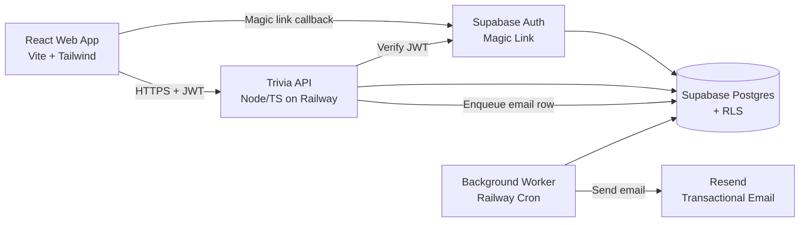
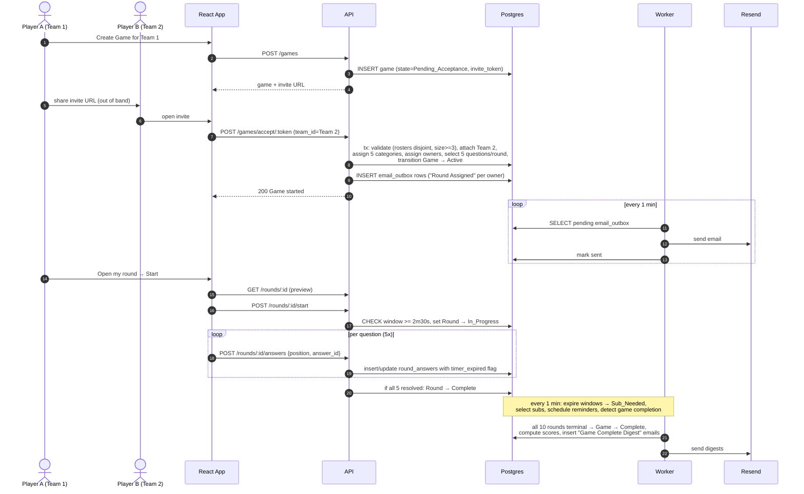
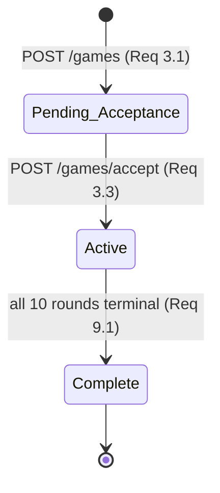
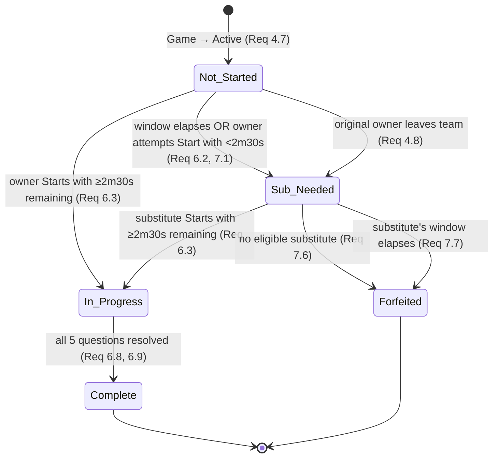

# Design Document: Trivia Squads MLP

## 1. Overview

Trivia Squads is an async-first, team-based trivia web application in which two Teams of 3–8 Players compete across a 5-Round Game. Each Round is owned by a single Player who answers 5 themed-Category Questions within a 12-hour Answer_Window. Notifications are email-only; there is no real-time or synchronous play. This design realizes the 15 requirements (plus Req 5b known-limitation) defined in `requirements.md`.

**Design tenets** (derived from requirements, not re-litigated here):

- **Bank-backed questions.** Questions are selected from a pre-populated Question_Bank at Game start, not generated at runtime (Req 5, Req 5b). No Claude or LLM runtime dependency.
- **Hard score lock during Active.** No API response or UI surface exposes any score-derived field while Game_State = Active (Req 8).
- **Async-safe state machines.** Round and Game transitions are driven by a background sweep against `answer_window_ends_at`, not by client requests.
- **Email & Display_Name only.** Players' email addresses are never exposed to other Players (Req 2.7, Req 15.5).
- **Scope discipline.** MLP-sized: single Postgres, single API, single email provider, one background worker. No queues, no caches, no sharding.

Req traceability is called out inline with each design decision (e.g., "Req 7.4").

---

## 2. Architecture Overview

### 2.1 Component diagram



**Boundaries:**

- The browser only talks to the API (JSON over HTTPS) and to Supabase Auth (magic link flow). It never writes to Postgres directly — even though Supabase permits it — because we want server-side invariants (roster overlap, window boundary, hard-lock) enforced in one place.
- The API is stateless. All state lives in Postgres.
- The Worker shares the same Postgres and the same domain code as the API (deployed as a separate Railway service with a cron schedule).
- Email dispatch is pull-based from an `email_outbox` table (Section 5), not push-from-API, to make delivery idempotent and retriable.

### 2.2 Critical-path request flow (creation → completion)



### 2.3 Deployment topology

One Railway project, two services:

| Service | Runtime | Process |
|---|---|---|
| `api` | Node 20 LTS | HTTP server (Fastify), serves React static assets + JSON API |
| `worker` | Node 20 LTS | Long-running process with internal cron (node-cron) running sweepers at configured intervals |

One Supabase project (Postgres 15, Auth). One Resend account (single sender domain).

Single region deployment. No CDN in MLP (static assets served from Railway). No read replicas.

---

## 3. Components and Interfaces

The services named in the requirements glossary (`Auth_Service`, `Team_Service`, `Game_Service`, `Round_Service`, `Question_Service`, `Scoring_Service`, `Status_Service`, `Notification_Service`) are realized as **modules inside a single Node/TS codebase**, not as separate network services. This keeps the MLP deployment simple while preserving the conceptual boundaries.

### 3.1 Module boundaries

| Module | Responsibility | Primary tables |
|---|---|---|
| `auth` | Verify Supabase JWTs on every request, ensure Display_Name set | `players` |
| `teams` | Create/join/leave Teams, enforce 3–8 size, issue invite tokens | `teams`, `team_memberships` |
| `games` | Create/accept Games, orchestrate Game start (atomic), detect Game completion | `games`, `rounds` |
| `rounds` | Round lifecycle: preview, start, answer submission, state machine | `rounds`, `round_owners`, `round_answers` |
| `questions` | Select 5 questions/Round with 10-game lookback + progressive relaxation | `questions`, `round_questions`, `games` |
| `scoring` | Compute Round_Score, Effective_Round_Score, Game_Score on Game completion | `rounds`, `round_answers` |
| `status` | Game status view with the discriminated-union response (active vs complete) | all game-related tables (read-only) |
| `notifications` | Enqueue email_outbox rows; Worker dispatches them | `email_outbox`, `notifications_sent` |
| `jobs` | Sweepers: window expiration, 12h reminder, 2h reminder, game completion detection | `rounds`, `round_owners`, `notifications_sent`, `email_outbox` |

### 3.2 Shared concerns

- **Transactions.** Every multi-row write that crosses an invariant boundary (Game start, substitute assignment, round completion, game completion) runs in a single Postgres transaction at `REPEATABLE READ` isolation. This makes ownership and scoring invariants (Req 11) observable at a point-in-time.
- **Clock source.** All timestamps are UTC `timestamptz`. The Worker uses `NOW()` in Postgres for window expiration, not wall-clock in Node, so sweeps are deterministic against the database.
- **Authorization.** Every API request passes through `auth` to resolve `player_id`, then the handler checks resource-level access (member of the Team, owner of the Round). Supabase RLS is configured as a defense-in-depth second check (Section 7).

---

## 4. Data Model

Postgres schema below. Types use Postgres conventions. `id` columns are `uuid` generated via `gen_random_uuid()` unless noted. Foreign keys cascade on delete only where the child row has no standalone meaning (e.g., `round_answers` → `rounds`).

### 4.1 DDL

```sql
-- ============================================================================
-- PLAYERS (Req 1, Req 15)
-- ============================================================================
CREATE TABLE players (
  id              uuid PRIMARY KEY DEFAULT gen_random_uuid(),
  -- auth_user_id links to auth.users.id from Supabase Auth.
  auth_user_id    uuid NOT NULL UNIQUE,
  email           text NOT NULL UNIQUE,  -- never exposed in API responses (Req 15.5)
  display_name    text,                  -- NULL until first-sign-in onboarding (Req 15.1)
  created_at      timestamptz NOT NULL DEFAULT now(),
  updated_at      timestamptz NOT NULL DEFAULT now(),
  CONSTRAINT display_name_length
    CHECK (display_name IS NULL OR (char_length(display_name) BETWEEN 1 AND 30))  -- Req 15.2
);

-- ============================================================================
-- TEAMS (Req 2)
-- ============================================================================
CREATE TABLE teams (
  id                    uuid PRIMARY KEY DEFAULT gen_random_uuid(),
  name                  text NOT NULL,
  organizer_player_id   uuid NOT NULL REFERENCES players(id),
  invite_link_token     text NOT NULL UNIQUE,  -- Req 2.2; 32 random bytes, base64url
  created_at            timestamptz NOT NULL DEFAULT now(),
  CONSTRAINT team_name_length CHECK (char_length(name) BETWEEN 1 AND 60)
);

CREATE INDEX ix_teams_organizer ON teams(organizer_player_id);

-- ============================================================================
-- TEAM MEMBERSHIPS (Req 2.1, 2.3, 2.8, 2.9, 15.7)
-- ============================================================================
CREATE TABLE team_memberships (
  team_id     uuid NOT NULL REFERENCES teams(id) ON DELETE CASCADE,
  player_id   uuid NOT NULL REFERENCES players(id),
  joined_at   timestamptz NOT NULL DEFAULT now(),
  PRIMARY KEY (team_id, player_id)
);

CREATE INDEX ix_tm_player ON team_memberships(player_id);

-- Size enforcement (Req 2.4) is handled application-side inside a transaction
-- because a CHECK on COUNT(*) is not supported in standard Postgres.
-- Display_Name uniqueness within a team (Req 15.7) is also enforced app-side
-- on join and on Display_Name update.

-- ============================================================================
-- GAMES (Req 3, Req 8, Req 9)
-- ============================================================================
CREATE TYPE game_state AS ENUM ('Pending_Acceptance', 'Active', 'Complete');

CREATE TABLE games (
  id                      uuid PRIMARY KEY DEFAULT gen_random_uuid(),
  creating_team_id        uuid NOT NULL REFERENCES teams(id),
  accepting_team_id       uuid NULL REFERENCES teams(id),  -- NULL until accepted (Req 3.3)
  state                   game_state NOT NULL DEFAULT 'Pending_Acceptance',
  game_invite_link_token  text NOT NULL UNIQUE,            -- Req 3.1
  created_at              timestamptz NOT NULL DEFAULT now(),
  started_at              timestamptz NULL,                -- set on Active (Req 3.9)
  completed_at            timestamptz NULL,                -- set on Complete (Req 9.1)
  CONSTRAINT distinct_teams
    CHECK (accepting_team_id IS NULL OR accepting_team_id <> creating_team_id),  -- Req 3.6
  CONSTRAINT active_has_opponent
    CHECK ((state = 'Pending_Acceptance' AND accepting_team_id IS NULL)
        OR (state IN ('Active', 'Complete') AND accepting_team_id IS NOT NULL))
);

CREATE INDEX ix_games_creating_team ON games(creating_team_id);
CREATE INDEX ix_games_accepting_team ON games(accepting_team_id);
CREATE INDEX ix_games_state ON games(state);
-- Used by the question-bank 10-most-recent-games lookback (Req 5.3):
CREATE INDEX ix_games_team_completed ON games(accepting_team_id, completed_at DESC)
  WHERE state = 'Complete';

-- Roster overlap (Req 3.8) is enforced at acceptance time by the games module
-- inside a transaction, not via SQL constraint.

-- ============================================================================
-- ROUNDS (Req 4, Req 6, Req 7, Req 11)
-- ============================================================================
CREATE TYPE round_state AS ENUM (
  'Not_Started', 'In_Progress', 'Complete', 'Sub_Needed', 'Forfeited'
);

CREATE TABLE rounds (
  id                          uuid PRIMARY KEY DEFAULT gen_random_uuid(),
  game_id                     uuid NOT NULL REFERENCES games(id) ON DELETE CASCADE,
  round_number                smallint NOT NULL,          -- 1..5 (Req 4.1)
  team_id                     uuid NOT NULL REFERENCES teams(id),
  category                    text NOT NULL,              -- Req 4.2
  original_owner_player_id    uuid NOT NULL REFERENCES players(id),  -- Req 4.7
  state                       round_state NOT NULL DEFAULT 'Not_Started',
  -- Effective Answer_Window end for the *currently active* owner (original or sub).
  -- Updated when a substitute is assigned (Req 7.5).
  answer_window_ends_at       timestamptz NOT NULL,
  started_at                  timestamptz NULL,           -- when transitioned to In_Progress
  completed_at                timestamptz NULL,
  UNIQUE (game_id, round_number, team_id),
  CONSTRAINT round_number_range CHECK (round_number BETWEEN 1 AND 5)
);

CREATE INDEX ix_rounds_game ON rounds(game_id);
CREATE INDEX ix_rounds_owner ON rounds(original_owner_player_id);
-- Used by the window-expiration sweeper (Section 5):
CREATE INDEX ix_rounds_sweep ON rounds(state, answer_window_ends_at)
  WHERE state IN ('Not_Started', 'Sub_Needed', 'In_Progress');

-- ============================================================================
-- ROUND OWNERS (Req 7) — history of owner assignments for a Round.
-- A Round has exactly one is_active=TRUE row at any time (Req 11.2).
-- Substitution history is retained so we can trace forfeits and sub events.
-- ============================================================================
CREATE TYPE round_owner_role AS ENUM ('original', 'substitute');

CREATE TABLE round_owners (
  id              uuid PRIMARY KEY DEFAULT gen_random_uuid(),
  round_id        uuid NOT NULL REFERENCES rounds(id) ON DELETE CASCADE,
  player_id       uuid NOT NULL REFERENCES players(id),
  role            round_owner_role NOT NULL,
  assigned_at     timestamptz NOT NULL DEFAULT now(),
  window_ends_at  timestamptz NOT NULL,   -- 12h from assigned_at (Req 7.5)
  is_active       boolean NOT NULL DEFAULT TRUE
);

-- Enforce at most one active owner per round (Req 11.2, Req 7.9):
CREATE UNIQUE INDEX uq_round_owners_active
  ON round_owners(round_id)
  WHERE is_active = TRUE;

-- Enforce at most one substitute per round across history (Req 7.9):
CREATE UNIQUE INDEX uq_round_owners_one_sub
  ON round_owners(round_id)
  WHERE role = 'substitute';

CREATE INDEX ix_round_owners_player_active
  ON round_owners(player_id) WHERE is_active = TRUE;

-- ============================================================================
-- QUESTIONS (Req 5, Req 5b) — pre-populated bank, maintained out of band.
-- ============================================================================
CREATE TABLE questions (
  id                  uuid PRIMARY KEY DEFAULT gen_random_uuid(),
  category            text NOT NULL,
  question_text       text NOT NULL,
  correct_answer_id   uuid NOT NULL,  -- FK set after answer_choices rows exist
  created_at          timestamptz NOT NULL DEFAULT now(),
  CONSTRAINT question_text_length CHECK (char_length(question_text) <= 200)  -- Req 5.6
);

CREATE INDEX ix_questions_category ON questions(category);

CREATE TABLE answer_choices (
  id            uuid PRIMARY KEY DEFAULT gen_random_uuid(),
  question_id   uuid NOT NULL REFERENCES questions(id) ON DELETE CASCADE,
  choice_text   text NOT NULL,
  position      smallint NOT NULL,  -- 1..6
  UNIQUE (question_id, position),
  CONSTRAINT position_range CHECK (position BETWEEN 1 AND 6)
);

-- Deferred FK from questions.correct_answer_id to answer_choices.id, plus the
-- 2..6 choices-per-question constraint (Req 5.6), enforced by a deferred trigger
-- that runs at COMMIT. The trigger counts choices for the question and asserts
-- 2 <= count <= 6 and that correct_answer_id matches a row in that set.

-- ============================================================================
-- ROUND QUESTIONS (Req 5.2, 5.5, 5.6) — the 5-question snapshot for a round.
-- ============================================================================
CREATE TABLE round_questions (
  round_id      uuid NOT NULL REFERENCES rounds(id) ON DELETE CASCADE,
  question_id   uuid NOT NULL REFERENCES questions(id),
  position      smallint NOT NULL,  -- 1..5
  PRIMARY KEY (round_id, position),
  UNIQUE (round_id, question_id),   -- Req 5.6: no repeat within a single round
  CONSTRAINT rq_position_range CHECK (position BETWEEN 1 AND 5)
);

-- Exactly 5 questions per round enforced app-side at Game start (Req 4.1, 5.2).

-- ============================================================================
-- ROUND ANSWERS (Req 6, Req 10)
-- ============================================================================
CREATE TABLE round_answers (
  round_id              uuid NOT NULL REFERENCES rounds(id) ON DELETE CASCADE,
  position              smallint NOT NULL,  -- 1..5 matches round_questions.position
  submitted_answer_id   uuid NULL REFERENCES answer_choices(id),  -- NULL iff timer expired (Req 6.6)
  is_correct            boolean NOT NULL DEFAULT FALSE,
  answered_at           timestamptz NULL,
  timer_expired         boolean NOT NULL DEFAULT FALSE,
  -- A timer_start_at is tracked so the 30s countdown is server-authoritative
  -- (the client cannot cheat the timer). Created on first view of the question.
  timer_started_at      timestamptz NULL,
  PRIMARY KEY (round_id, position),
  CONSTRAINT answer_consistency CHECK (
    (submitted_answer_id IS NULL AND timer_expired = TRUE)  -- unanswered → timer expired
    OR (submitted_answer_id IS NOT NULL)
  )
);

-- ============================================================================
-- EMAIL OUTBOX + NOTIFICATION LEDGER (Req 12)
-- email_outbox is the queue the Worker drains.
-- notifications_sent is the idempotency ledger — one row per (player, game,
-- round, notification_type). We check it before enqueueing so we never send
-- the same email twice on sweeper retries.
-- ============================================================================
CREATE TYPE notification_type AS ENUM (
  'round_assigned',        -- Req 12.1
  'reminder_12h',          -- Req 12.2
  'reminder_2h',           -- Req 12.3
  'substitute_needed',     -- Req 12.4
  'game_complete_digest'   -- Req 12.5
);

CREATE TABLE email_outbox (
  id                  uuid PRIMARY KEY DEFAULT gen_random_uuid(),
  player_id           uuid NOT NULL REFERENCES players(id),
  game_id             uuid NOT NULL REFERENCES games(id),
  round_id            uuid NULL REFERENCES rounds(id),  -- NULL for game-level emails
  notification_type   notification_type NOT NULL,
  payload_json        jsonb NOT NULL,   -- body inputs (category, window end, digest data)
  enqueued_at         timestamptz NOT NULL DEFAULT now(),
  sent_at             timestamptz NULL,
  send_attempts       smallint NOT NULL DEFAULT 0,
  last_error          text NULL
);

CREATE INDEX ix_outbox_unsent ON email_outbox(enqueued_at)
  WHERE sent_at IS NULL;

CREATE TABLE notifications_sent (
  player_id           uuid NOT NULL REFERENCES players(id),
  game_id             uuid NOT NULL REFERENCES games(id),
  round_id            uuid NULL,            -- NULL for game-level notifications
  notification_type   notification_type NOT NULL,
  sent_at             timestamptz NOT NULL DEFAULT now(),
  -- NULL round_id must be distinguishable in the uniqueness constraint.
  -- We use a generated column that coalesces NULL to the zero UUID for the PK.
  round_id_key        uuid GENERATED ALWAYS AS
    (COALESCE(round_id, '00000000-0000-0000-0000-000000000000'::uuid)) STORED,
  PRIMARY KEY (player_id, game_id, round_id_key, notification_type)
);

-- ============================================================================
-- SITTERS (Req 4.6) — Players who were not assigned any round at Game start,
-- but may still be selected as substitutes (Req 7.2).
-- ============================================================================
CREATE TABLE game_sitters (
  game_id     uuid NOT NULL REFERENCES games(id) ON DELETE CASCADE,
  team_id     uuid NOT NULL REFERENCES teams(id),
  player_id   uuid NOT NULL REFERENCES players(id),
  PRIMARY KEY (game_id, team_id, player_id)
);
```

### 4.2 Requirement-to-schema map

| Requirement | Enforced by |
|---|---|
| Req 1 (auth) | `players.auth_user_id` + Supabase Auth |
| Req 2.4 (team ≤ 8) | Application check inside membership-insert transaction |
| Req 2.7 / 15.5 (email never exposed) | Application serializer + RLS on `players` (Section 7) |
| Req 3.6 (no self-play) | `games.distinct_teams` CHECK |
| Req 3.8 (roster disjoint) | Transaction at acceptance time (see Section 4.3) |
| Req 4.1 (exactly 5 rounds) | Application-side count during Game start transaction |
| Req 5.6 (no repeat in round) | `round_questions (round_id, question_id)` UNIQUE |
| Req 5.6 (question text ≤ 200) | `questions.question_text_length` CHECK |
| Req 5.6 (2–6 choices + valid correct) | Deferred trigger at COMMIT |
| Req 6.6 (unanswered = incorrect) | `round_answers.answer_consistency` CHECK + app sets `is_correct=FALSE` |
| Req 7.9 (≤1 substitute per round) | `uq_round_owners_one_sub` partial unique index |
| Req 11.2 (one active owner) | `uq_round_owners_active` partial unique index |
| Req 12 idempotency | `notifications_sent` PK |
| Req 15.2 (display name length) | `players.display_name_length` CHECK |
| Req 15.7 (display name unique within team) | Application check at join + profile-update time |

### 4.3 Concurrency-sensitive transactions

Three operations require careful transaction scoping. All run at `REPEATABLE READ` and re-read the source rows inside the transaction rather than trusting an earlier read:

1. **Team join.** Read `team_memberships` for the team with `SELECT ... FOR UPDATE` on the `teams` row; validate count < 8; insert. Prevents a race where two invitees join simultaneously and push the team to 9.
2. **Game acceptance (Req 3.3, 3.6, 3.8).** Lock both team rows `FOR UPDATE`; verify both sizes ≥ 3; verify disjoint rosters; insert `accepting_team_id`, transition to Active, create rounds, select questions, enqueue emails. A single transaction start-to-finish.
3. **Round answer submission.** Lock the `rounds` row; verify `state = In_Progress`; verify `timer_started_at + 30s > NOW()` for the current position; upsert `round_answers`; if all 5 positions resolved, transition to Complete.

---

## 5. API Design

All endpoints are JSON over HTTPS. Authentication is via a Supabase-issued JWT passed as `Authorization: Bearer <token>`. Endpoints that require auth are marked ✓; those that don't are marked ✗ (only the magic-link initiation is unauthenticated).

Common response envelope for errors:

```json
{ "error": { "code": "ROSTER_OVERLAP", "message": "...", "details": { ... } } }
```

Error codes are stable identifiers; see Section 9 for the full table.

### 5.1 Auth (Req 1, Req 15)

| Method | Path | Auth | Purpose | Req |
|---|---|---|---|---|
| POST | `/auth/magic-link` | ✗ | Request magic link to email | 1.1 |
| GET | `/auth/callback` | ✗ | Supabase redirect target, exchanges code for session | 1.2, 1.3 |
| POST | `/auth/sign-out` | ✓ | Invalidate session | 1.5 |

Magic-link expiry/reuse handling (Req 1.3) is delegated to Supabase Auth's built-in behavior.

### 5.2 Players (Req 15)

| Method | Path | Auth | Purpose | Req |
|---|---|---|---|---|
| GET | `/players/me` | ✓ | Return own record (id, display_name, email) | 15 |
| POST | `/players` | ✓ | First-sign-in: set initial Display_Name | 15.1, 15.2 |
| PATCH | `/players/me` | ✓ | Update Display_Name | 15.3, 15.4, 15.7 |

`POST /players` body:
```json
{ "display_name": "matt" }
```
Returns 409 `DISPLAY_NAME_TAKEN_IN_TEAM` if Req 15.7 check fails (rare on first sign-in, guaranteed no-op unless the player is simultaneously joining a team via a deep link).

### 5.3 Teams (Req 2)

| Method | Path | Auth | Purpose | Req |
|---|---|---|---|---|
| POST | `/teams` | ✓ | Create a new Team (creator becomes Organizer + first member) | 2.1, 2.2 |
| GET | `/teams/:id` | ✓ | Team detail: name, members (Display_Name only), size | 2.6, 2.7 |
| POST | `/teams/join/:token` | ✓ | Join via invite link | 2.3, 2.4, 2.5, 15.7 |
| POST | `/teams/:id/leave` | ✓ | Leave a team | 2.8 |
| GET | `/teams/mine` | ✓ | List teams the current player belongs to | 2.9 |

`POST /teams`:
```json
// request
{ "name": "The Quiz Kids" }
// response
{ "id": "...", "name": "The Quiz Kids", "invite_link_token": "b64url...", "member_count": 1 }
```

`GET /teams/:id`:
```json
{
  "id": "...",
  "name": "The Quiz Kids",
  "member_count": 4,
  "members": [
    { "player_id": "...", "display_name": "matt", "is_organizer": true },
    { "player_id": "...", "display_name": "alex", "is_organizer": false }
  ],
  "invite_link_token": "b64url..."   // only returned to members
}
```

Note: `email` is **never** in the response. Display_Name only (Req 2.7, 15.5).

### 5.4 Games (Req 3, Req 8, Req 9)

| Method | Path | Auth | Purpose | Req |
|---|---|---|---|---|
| POST | `/games` | ✓ | Create a Game from one of the caller's teams (≥3 members) | 3.1, 3.2 |
| POST | `/games/accept/:token` | ✓ | Accept with one of caller's eligible teams; transitions to Active | 3.3–3.8, 4, 5, 12.1 |
| GET | `/games/:id/status` | ✓ | In-game status view (HARD-LOCKED during Active) | 8 |
| GET | `/games/:id/results` | ✓ | Complete game view (scores visible) | 8.4, 9 |

`POST /games`:
```json
// request
{ "team_id": "..." }
// response
{ "id": "...", "state": "Pending_Acceptance", "game_invite_link_token": "...", "created_at": "..." }
```

`POST /games/accept/:token`:
```json
// request
{ "team_id": "..." }  // omitted if caller has exactly one eligible team (Req 3.4)
```

**`GET /games/:id/status` — the discriminated-union response (Req 8).** The shape returned depends strictly on `games.state`. No conditional field on a single shape — two distinct shapes, because that makes it impossible to accidentally leak scores from an active game.

```ts
// Discriminated union. `state` is the discriminator.
type GameStatus =
  | GameStatusPending
  | GameStatusActive        // HARD-LOCKED: NEVER contains score/correctness data
  | GameStatusComplete;

interface GameStatusPending {
  state: 'Pending_Acceptance';
  game_id: string;
  creating_team: { id: string; name: string; member_count: number };
  created_at: string;
  // No rounds exist yet.
}

interface GameStatusActive {
  state: 'Active';
  game_id: string;
  started_at: string;
  teams: Array<{
    id: string;
    name: string;
    member_count: number;
    rounds: Array<{
      round_number: 1 | 2 | 3 | 4 | 5;
      category: string;
      // Completion-state only. No score, no correctness, no answer data.
      status:
        | { kind: 'not_started'; hours_remaining: number }       // Req 8.1
        | { kind: 'in_progress'; hours_remaining: number }       // Req 8.1
        | { kind: 'sub_needed' }                                 // Req 8.1
        | { kind: 'forfeited' }                                  // Req 8.1
        | { kind: 'complete' };                                  // Req 8.1 (no score)
      // The identity of the active owner is ONLY returned to members of this
      // team. Opponent-team members see `current_owner: null`.
      current_owner: { player_id: string; display_name: string } | null;
    }>;
  }>;
}

interface GameStatusComplete {
  state: 'Complete';
  game_id: string;
  completed_at: string;
  outcome: 'team_a_win' | 'team_b_win' | 'tie';
  teams: Array<{
    id: string;
    name: string;
    game_score: number;  // [0.0, 5.0]  (Req 10.5)
    rounds: Array<{
      round_number: 1 | 2 | 3 | 4 | 5;
      category: string;
      final_state: 'Complete' | 'Forfeited';
      round_score: number | null;            // [0.0, 1.0] or null if forfeited
      effective_round_score: number;         // [0.0, 1.0]  (Req 10.4)
      completed_by: { player_id: string; display_name: string; role: 'original' | 'substitute' } | null;
      // Per-question correctness visible post-completion (Req 8.4).
      questions: Array<{
        position: 1 | 2 | 3 | 4 | 5;
        question_text: string;
        correct_answer_id: string;
        submitted_answer_id: string | null;
        is_correct: boolean;
      }>;
    }>;
  }>;
}
```

Server-side enforcement: the `status` handler is the **only** code path that returns round/score data for a game. It branches on `games.state` once, at the top, and calls two entirely separate serializer functions (`serializeActive`, `serializeComplete`). There is no shared code path where a conditional `if (complete) include scores` could be flipped. This makes the hard-lock (Req 8.2) an architectural invariant, not a runtime branch.

`GET /games/:id/results` is a convenience alias for `GET /games/:id/status` when `state = Complete`; it returns 409 if the game is still Active, to prevent accidental polling for a reveal.

### 5.5 Rounds (Req 6)

| Method | Path | Auth | Purpose | Req |
|---|---|---|---|---|
| GET | `/rounds/:id` | ✓ (owner) | Preview screen: category, question count, timer duration | 6.1, 6.10 |
| POST | `/rounds/:id/start` | ✓ (owner) | Transition to In_Progress (validates ≥ 2m30s remaining) | 6.2, 6.3 |
| GET | `/rounds/:id/questions/:position` | ✓ (owner) | Fetch the next question, start 30s timer server-side | 6.4, 6.11 |
| POST | `/rounds/:id/answers` | ✓ (owner) | Submit an answer for a position | 6.5, 6.6, 6.8, 6.11 |

Only the current active Round_Owner (original or substitute) can call any of these endpoints. Non-owners receive 403 (Req 8.3).

`GET /rounds/:id` response (preview, Req 6.1):
```json
{
  "id": "...",
  "game_id": "...",
  "category": "Geography",
  "question_count": 5,
  "question_timer_seconds": 30,
  "answer_window_ends_at": "2026-04-15T14:00:00Z",
  "can_start": true,
  "cannot_start_reason": null   // or "INSUFFICIENT_WINDOW" (Req 6.2)
}
```

`POST /rounds/:id/start` returns 409 `INSUFFICIENT_WINDOW` and triggers the sub flow server-side (Req 6.2) if `answer_window_ends_at - NOW() < 150s`.

`GET /rounds/:id/questions/:position` starts the 30-second timer server-side (`timer_started_at = NOW()`) on first fetch for that position. Subsequent fetches of the same position return the same `timer_started_at` and a computed `seconds_remaining` — this prevents the client from resetting the timer by refreshing (Req 6.11).

```json
{
  "position": 1,
  "question_text": "...",
  "choices": [ { "id": "...", "text": "..." }, ... ],
  "timer_started_at": "2026-04-14T14:00:10Z",
  "seconds_remaining": 22
}
```

`POST /rounds/:id/answers`:
```json
// request
{ "position": 1, "answer_id": "..." }
```
Server computes correctness against `questions.correct_answer_id` but does **not** return `is_correct` in the response (Req 8.3). The response echoes the position and indicates whether more questions remain:
```json
{ "accepted": true, "next_position": 2, "round_complete": false }
```
On the last submission, `round_complete: true`. The client navigates to a generic "Round submitted — results at game end" screen.

### 5.6 Summary: which endpoints can return score-derived data?

Exactly one endpoint, under exactly one condition: `GET /games/:id/status` when `games.state = 'Complete'`. Every other endpoint either returns no score data or returns 403/409 before any handler that could access score data runs.

---

## 6. Key Algorithms

### 6.1 Round category and ownership assignment (Req 4)

Runs inside the Game-acceptance transaction, once per Game.

```text
function assignRounds(game, teamA, teamB, now):
  # Req 4.2: draw 5 distinct categories
  categories = random.sample(CATEGORY_CATALOG, 5)

  rounds = []
  for i in 1..5:
    for team in [teamA, teamB]:
      rounds.append(Round(
        game_id=game.id, round_number=i, team_id=team.id,
        category=categories[i-1]))

  # Req 4.3–4.6: minimum-imbalance owner assignment per team
  for team in [teamA, teamB]:
    members = shuffled(team.members_at(now))
    teamRounds = [r for r in rounds if r.team_id == team.id]

    if len(members) >= 5:
      # Req 4.4 / 4.6: pick 5 distinct owners; rest are sitters
      owners = members[:5]
      sitters = members[5:]
      for (r, p) in zip(teamRounds, owners):
        r.original_owner = p
      record_sitters(game, team, sitters)
    else:
      # Req 4.5: round-robin; max per player = ceil(5 / team_size)
      for idx, r in enumerate(teamRounds):
        r.original_owner = members[idx % len(members)]

  # Req 4.7: set window_ends_at for all to game.started_at + 24h
  for r in rounds:
    r.state = 'Not_Started'
    r.answer_window_ends_at = now + 12h
    insert_round_owner(r, r.original_owner, role='original',
                       assigned_at=now, window_ends_at=now+12h, is_active=True)

  return rounds
```

Randomness: `random.sample` and `shuffled` use a crypto-seeded PRNG per request to avoid determinism from a seeded RNG ever leaking across games.

### 6.2 Question selection from bank (Req 5)

Runs once per round at Game start, immediately after Section 6.1. Per-Team lookback, per Req 5.3.

```text
function selectQuestions(round, team, lookbackGames=10):
  excluded = set()
  # Req 5.3: all question_ids that appeared in the team's 10 most recent
  # completed games, across both teams' rounds in those games.
  for g in recent_completed_games(team, limit=lookbackGames):
    excluded.update(question_ids_in_game(g))

  pool = questions_in_category(round.category) - excluded
  lookback = lookbackGames

  # Req 5.4: progressive relaxation
  while len(pool) < 5 and lookback > 0:
    lookback -= 1
    excluded = set()
    for g in recent_completed_games(team, limit=lookback):
      excluded.update(question_ids_in_game(g))
    pool = questions_in_category(round.category) - excluded

  if len(pool) < 5:
    # Degraded state — see Section 9. Allow any question in the category.
    pool = questions_in_category(round.category)
    if len(pool) < 5:
      raise QuestionBankExhausted(round.category)

  chosen = random.sample(pool, 5)
  for position, q in enumerate(chosen, start=1):
    insert_round_question(round, q, position)
```

Performance note: `recent_completed_games(team, 10)` is a single indexed query against `ix_games_team_completed`. `question_ids_in_game(g)` joins `rounds → round_questions`. For 10 games × 10 rounds × 5 questions = 500 excluded IDs, which is negligible.

### 6.3 Substitute eligibility selection (Req 7)

Triggered by the expiration sweeper (Section 7 below) when a round's window elapses while `state ∈ {Not_Started, Sub_Needed}`. **Never** triggered for In_Progress rounds (Req 6.9).

```text
function assignSubstitute(round, now):
  team = team_of(round)
  # Req 7.2: eligible set = team members with no "open" round in this game.
  # "Open" = Not_Started, In_Progress, or Sub_Needed where player is active owner.
  open_owners = active_owner_player_ids_in_game(round.game_id)
  eligible = [p for p in team.members if p.id not in open_owners
                and p.id != round.current_active_owner.player_id]  # Req 7.3

  if not eligible:
    # Req 7.6
    round.state = 'Forfeited'
    mark_effective_score(round, 0)
    return None

  sub = random.choice(eligible)
  # Deactivate prior active owner; insert new active owner (Req 11.2)
  deactivate_current_active_owner(round)
  insert_round_owner(round, sub, role='substitute',
                     assigned_at=now, window_ends_at=now+12h, is_active=True)
  round.answer_window_ends_at = now + 12h   # Req 7.5
  round.state = 'Sub_Needed'   # will become In_Progress when sub hits Start
  enqueue_email(sub, round, 'substitute_needed')  # Req 12.4
  return sub
```

**Simultaneous expiration on the same team (Req 7.4).** The sweeper collects the set of rounds on the same team that expire in the same sweep cycle, sorts them ascending by `round_number`, and calls `assignSubstitute` on them one at a time, re-reading `active_owner_player_ids_in_game` between calls. The set shrinks as earlier assignments pull eligible players into the `open_owners` set for later iterations.

### 6.4 Game completion detection (Req 9)

Not time-driven — triggered on every round state transition that could be terminal (`Complete` or `Forfeited`). Checks if all 10 rounds in the game are terminal; if yes, transitions the game to Complete in the same transaction, computes scores, and enqueues the digest emails.

```text
function maybeCompleteGame(game_id, tx):
  rounds = tx.select_rounds(game_id)
  if len(rounds) != 10: return  # defensive
  if not all(r.state in ('Complete', 'Forfeited') for r in rounds): return

  # Req 9.3: compute per-team Game_Score
  scores = {}
  for team_id in distinct_team_ids(rounds):
    teamRounds = [r for r in rounds if r.team_id == team_id]
    scores[team_id] = sum(effective_round_score(r) for r in teamRounds)

  tx.update_game(game_id, state='Complete', completed_at=NOW())
  # Req 9.4 / 9.5: recording win/loss/tie is implicit in stored Game_Scores;
  # the aggregated record display (Req 9.6) is a read-time query.

  # Req 12.5: enqueue digest for every member of both teams
  for team_id, team_score in scores.items():
    for player_id in team_members(team_id):
      if not already_sent(player_id, game_id, 'game_complete_digest'):
        enqueue_email(player_id, game_id, 'game_complete_digest',
                      payload={team_scores: scores, rounds: rounds})
```

`effective_round_score` follows Req 10.2 exactly: `Round_Score` for originals, `Round_Score × 0.8` for subs, `0` for forfeits.

---

## 7. Background Jobs / Scheduled Work

One `worker` process runs all sweepers. Each sweeper is idempotent; concurrent invocations are safe because writes are gated by `notifications_sent` uniqueness and by row-level locks. Cadences below are defaults, overridable via env var.

| Job | Default cadence | Purpose | Idempotency |
|---|---|---|---|
| Window expiration sweeper | every 1 min | Find rounds where `answer_window_ends_at ≤ NOW()` AND `state ∈ (Not_Started, Sub_Needed)`; run substitute assignment (Req 7.1) or forfeit (Req 7.7). | State transition is a no-op if state is already terminal. |
| 6-hour reminder scheduler | every 5 min | Find active owners whose window ends in [5h55m, 6h05m] and are not Complete; enqueue `reminder_6h`. (Req 12.2) | `notifications_sent` row prevents duplicate. |
| 2-hour reminder scheduler | every 5 min | Same as above, window in [1h55m, 2h05m]. (Req 12.3) | Same. |
| Email dispatcher | every 30 s | Drain `email_outbox` where `sent_at IS NULL`, send via Resend, update `sent_at` or `last_error` + `send_attempts`. | `email_outbox.sent_at` prevents resend; on failure, retries up to 5× with exponential backoff. |
| Game completion detector | **not scheduled** | Triggered inline from round state transitions (Section 6.4). | `games.state = Complete` idempotent transition + `notifications_sent` for digests. |

Sweeper implementation pattern (all follow this shape):

```text
function windowExpirationSweep():
  with tx:
    rows = tx.execute("""
      SELECT id, game_id, team_id, round_number, state
      FROM rounds
      WHERE state IN ('Not_Started', 'Sub_Needed')
        AND answer_window_ends_at <= NOW()
      ORDER BY team_id, round_number
      FOR UPDATE SKIP LOCKED
      LIMIT 500
    """)

    # Group by team_id to respect Req 7.4 sequential processing
    for team_id, team_rows in groupby(rows, key=lambda r: r.team_id):
      for r in sorted(team_rows, key=lambda x: x.round_number):
        assignSubstitute(r, NOW())   # or forfeit if no eligible
        maybeCompleteGame(r.game_id, tx)
```

`FOR UPDATE SKIP LOCKED` lets multiple workers (if ever scaled) share the sweep without double-processing. For MLP we run exactly one worker instance.

**6h / 2h reminder boundaries.** The 10-minute window ([x-5m, x+5m] in the table above) is wider than the 5-minute cadence to guarantee at-least-once scheduling even if a sweep runs slightly late. The `notifications_sent` ledger guarantees at-most-once delivery.

---

## 8. State Machines

### 8.1 Game_State (Req 3, Req 9)



No transition from Active back to Pending_Acceptance. No transition from Complete anywhere.

### 8.2 Round_State (Req 4, Req 6, Req 7)



Critical: once `In_Progress`, the only outbound transition is `Complete` (Req 6.9). Expiration sweeper ignores `In_Progress` rounds.

---

## 9. Security & Privacy

### 9.1 Authentication

- **Magic link** via Supabase Auth (Req 1.1–1.4). Magic link lifetime and single-use enforcement come from Supabase defaults; link expiry (Req 1.3) is handled by Supabase's error response, which we surface to the UI.
- **Session** via JWT. The API verifies the JWT signature using Supabase's JWKS on every request; no session state is held server-side.
- **Sign-out** clears the client-side JWT (Req 1.5). Token rotation is Supabase default (1 hour).

### 9.2 Authorization model

Two layers:

**Layer 1 — Application-side checks (primary).** Every handler explicitly checks:
- `players/*`: caller is the subject player.
- `teams/:id`: caller is a member of the team.
- `teams/join/:token`: caller is authenticated; token is valid.
- `games/:id/*`: caller is a member of one of the two participating teams.
- `rounds/:id/*`: caller is the current **active** Round_Owner (original or substitute). Non-owners receive 403 even if they're on the same team (Req 8.3).

**Layer 2 — Supabase Row Level Security (defense-in-depth).** Even though the API never lets the browser query Postgres directly in MLP, RLS policies are configured so that if that design changes (e.g., future Supabase client use), no privilege-escalation bugs in the API can be compounded by a direct DB path. Policies:

```sql
-- Players: a Player can only SELECT their own row.
CREATE POLICY p_self ON players FOR SELECT USING (auth_user_id = auth.uid());

-- Teams: a Player can SELECT a team iff they are a member.
CREATE POLICY t_member ON teams FOR SELECT USING (
  EXISTS (SELECT 1 FROM team_memberships tm
           JOIN players p ON p.id = tm.player_id
          WHERE tm.team_id = teams.id AND p.auth_user_id = auth.uid()));

-- Games: a Player can SELECT a game iff they are a member of a participating team.
CREATE POLICY g_participant ON games FOR SELECT USING (
  EXISTS (SELECT 1 FROM team_memberships tm
           JOIN players p ON p.id = tm.player_id
          WHERE p.auth_user_id = auth.uid()
            AND tm.team_id IN (games.creating_team_id, games.accepting_team_id)));

-- Rounds: a Player can SELECT question/answer detail iff they are the active owner.
-- Non-owner reads are handled by the API serializer, not by RLS, because
-- RLS can't express "only return question_text for active owner".
-- RLS denies ALL direct reads of round_questions and round_answers to the
-- client role; only the service role (used by API) can read them.
REVOKE SELECT ON round_questions, round_answers FROM authenticated;
GRANT  SELECT ON round_questions, round_answers TO service_role;
```

The API uses the `service_role` key (held server-side only) for DB access; the browser never holds it.

### 9.3 Privacy: email never exposed (Req 2.7, 15.5)

All serializers for Team, Game, and Round views return `display_name` only. The `players` table is accessed via a view `players_public` that projects `(id, display_name)`, and every cross-player serializer reads from that view. The only handler that ever returns `email` is `GET /players/me`.

### 9.4 Invite tokens

- `teams.invite_link_token`: 32 bytes of `crypto.randomBytes`, base64url-encoded (43 chars). Never expires, but is **rotatable** via `POST /teams/:id/rotate-invite` (implementation detail, out of core endpoints table). This lets an Organizer revoke a leaked link.
- `games.game_invite_link_token`: 32 bytes, base64url. Becomes effectively invalid when the Game transitions out of Pending_Acceptance (the acceptance handler returns `GAME_NOT_ACCEPTING` for Active/Complete games — Req 3.7). We do not delete the token, so the status redirect in Req 3.7 still works for members.

### 9.5 Transport and at-rest

HTTPS-only (Railway terminates TLS). Postgres at rest is encrypted by Supabase defaults. No secrets (magic link tokens, JWTs) are logged.

---

## 10. Correctness Properties

*A property is a characteristic or behavior that should hold true across all valid executions of a system — essentially, a formal statement about what the system should do. Properties serve as the bridge between human-readable specifications and machine-verifiable correctness guarantees.*

Property-based testing is appropriate for this feature because the core game logic (ownership assignment, question selection, scoring, state transitions, hard-lock) consists of pure-ish operations over well-defined inputs (team rosters, answer patterns, lifecycle events). The MLP's user interaction surface is captured as inputs to a domain model we can drive directly in tests, with the database mocked or substituted by an in-memory store.

The properties below were derived via the prework pass over every acceptance criterion, then consolidated to eliminate redundancy. Each property maps back to the specific requirement clauses it validates.

### Property 1: Roster Disjoint

*For any* two Teams each of size ≥ 3 with possibly overlapping memberships, Game acceptance succeeds if and only if the two rosters share no Player; if any Player is on both Teams at the moment of acceptance, acceptance is rejected with an error identifying the overlapping Player(s).

**Validates: Requirements 3.8**

### Property 2: Game Creates Correct Round Structure

*For any* Game that successfully transitions to Game_State Active, each of the two Teams has exactly 5 Rounds (10 Rounds total per Game), and each Round has exactly 5 Questions drawn for it, each Question pairwise distinct within a Round.

**Validates: Requirements 4.1, 5.2, 5.6, 11.1**

### Property 3: Category Distinctness

*For any* Game start, the 5 Categories assigned to the Game's Rounds are pairwise distinct elements of the Category_Catalog (one Category per round number, applied to both Teams' same-numbered Rounds).

**Validates: Requirements 4.2**

### Property 4: Owner Assignment Minimizes Imbalance

*For any* Team of size *n* ∈ [3, 8] at Game start, the assignment of 5 Rounds to Team members satisfies: (a) every assigned Player is a member of the Team at Game start, (b) the maximum number of Rounds assigned to any single Player is `ceil(5 / min(n, 5))` (equivalently: `1` for *n* ≥ 5, `2` for *n* ∈ [3, 4]), (c) for *n* ≥ 5 the 5 owners are pairwise distinct, and (d) for *n* > 5 exactly *n* − 5 Players are recorded as sitters and the remaining 5 are owners.

**Validates: Requirements 4.3, 4.4, 4.5, 4.6, 11.4**

### Property 5: Question Reuse Policy

*For any* Game start for a given Team, the 25 Questions selected across that Team's 5 Rounds do not appear in any of the Team's 10 most recent Completed Games, except when the eligible pool in a Category contains fewer than 5 Questions, in which case the lookback window is progressively relaxed (10 → 9 → ... → 0) to the smallest value at which at least 5 eligible Questions exist, and the reuse constraint holds at that relaxed lookback.

**Validates: Requirements 5.3, 5.4**

### Property 6: Round Question Snapshot Is Stable

*For any* Round that has been created as part of a Game start, repeated fetches of the Round's Question set return the identical 5 Questions (same IDs, same positions) for the lifetime of the Round.

**Validates: Requirements 5.5**

### Property 7: Start-Window Boundary

*For any* Round in Round_State Not_Started or Sub_Needed, an attempt by the current Round_Owner to activate "Start Round" succeeds (transitions the Round to In_Progress) if and only if the remaining Answer_Window at the moment of the request is ≥ 2 minutes 30 seconds (150 seconds). If the remaining window is less than 150 seconds, Start is rejected and the Round transitions to Sub_Needed (triggering the substitute flow).

**Validates: Requirements 6.2, 6.3**

### Property 8: In-Progress Only Completes

*For any* Round that reaches Round_State In_Progress, the only terminal state that Round ever reaches is Complete — regardless of whether the Answer_Window elapses during play. Additionally, once a Question's Question_Timer has started, no later submission for that position can change the recorded answer or correctness after the timer expires.

**Validates: Requirements 6.9, 6.11**

### Property 9: Round Ownership Invariant

*For any* Round at any point in its lifecycle, there is exactly one `round_owners` row with `is_active = TRUE`, that row's `window_ends_at = assigned_at + 12h`, and across the Round's entire history at most one `round_owners` row has `role = 'substitute'`.

**Validates: Requirements 4.7, 7.5, 7.9, 11.2**

### Property 10: Substitute Eligibility

*For any* substitute assignment event in a Game, (a) the selected Active_Substitute is a member of the Round's Team, (b) at the moment of selection the Active_Substitute was not the current active Round_Owner of the Round and was not the current active Round_Owner of any other Round in the Game, and (c) when multiple Rounds on the same Team expire simultaneously, substitutes are assigned sequentially in ascending Round number order, with eligibility re-evaluated against the updated ownership state between each assignment.

**Validates: Requirements 7.2, 7.3, 7.4**

### Property 11: Scoring Formula and Bounds

*For any* completed Game, every Round's scoring satisfies the full set of bounds and formulas:

- Round_Score = (count of correct answers in the Round) / 5, and Round_Score ∈ [0.0, 1.0].
- Effective_Round_Score equals Round_Score when the Round was completed by the Original_Owner, Round_Score × 0.8 when completed by an Active_Substitute, and exactly 0 when the Round is Forfeited, and Effective_Round_Score ∈ [0.0, 1.0].
- Each Team's Game_Score equals the sum of that Team's 5 Effective_Round_Scores (exact equality, accounting for floating-point representation within a tolerance of 1e-9), and Game_Score ∈ [0.0, 5.0].
- No term in any of the above formulas references the size of either Team (Req 14.1 — no handicap).

**Validates: Requirements 6.8, 7.6, 7.7, 7.8, 9.3, 10.1, 10.2, 10.3, 10.4, 10.5, 11.3, 14.1**

### Property 12: Hard-Lock Integrity

*For any* API request served while the containing Game is in Game_State Active, the response body contains no field derivable from Round_Score, Effective_Round_Score, Game_Score, per-Question correctness, or a submitted answer value, and the response body contains no Question text or answer-choice content for any Round whose current active Round_Owner is not the calling Player.

**Validates: Requirements 8.2, 8.3**

### Property 13: Email Privacy

*For any* API response and *for any* Notification_Service email sent to a recipient who is not the subject Player, the message contains no other Player's email address; Players are identified in all cross-Player surfaces only by Display_Name.

**Validates: Requirements 2.7, 15.5**

### Property 14: Display Name Constraints

*For any* proposed Display_Name string *s*, the System accepts *s* as a valid Display_Name (on creation or update) if and only if 1 ≤ char_length(*s*) ≤ 30, and *for any* Team at any point in its lifetime, no two current members of that Team share the same Display_Name.

**Validates: Requirements 15.2, 15.3, 15.7**

### Property 15: Display Name Propagation

*For any* Player who updates their Display_Name to a valid new value, all subsequent Team member list responses, Game status/results responses, and Game Complete Digest emails that reference that Player use the new Display_Name.

**Validates: Requirements 15.4**

### Property 16: Membership Round-Trip

*For any* Team and any authenticated Player, (a) opening a valid Team_Invite_Link when already a member is a no-op on the membership set, and (b) joining a Team and then leaving the Team restores the original membership set.

**Validates: Requirements 2.5, 2.8**

### Property 17: Notification Idempotency and Coverage

*For any* Game lifecycle event that triggers email, the `notifications_sent` ledger contains exactly one matching row per (Player, Game, Round, notification_type) tuple — regardless of how many times the relevant sweeper or dispatcher runs — and coverage is complete: every Original_Owner receives a `round_assigned` on Game start, every Active_Substitute receives a `substitute_needed` on assignment, and every member of both Teams receives a `game_complete_digest` on Game completion.

**Validates: Requirements 12.1, 12.4, 12.5**

### Property 18: Game Completion Trigger

*For any* Game, as soon as all 10 of its Rounds have reached a terminal state (Complete or Forfeited), the Game transitions to Game_State Complete, `completed_at` is set, and `Game_Score` is computed for each Team before any post-completion API response is served.

**Validates: Requirements 9.1, 9.2**

---

## 11. Error Handling & Edge Cases

All errors use stable `code` identifiers. The UI maps each code to a user-facing message; codes are never localized. HTTP status codes follow standard REST conventions.

| Condition | HTTP | Error code | Req | Notes |
|---|---|---|---|---|
| Magic link expired or already used | 401 | `MAGIC_LINK_INVALID` | 1.3 | Response body includes `resend_url` for Re-request. |
| Unauthenticated request to protected endpoint | 401 | `UNAUTHENTICATED` | 1 | JWT missing/invalid/expired. |
| Display_Name empty or > 30 chars | 400 | `DISPLAY_NAME_INVALID` | 15.2 | Returned by POST /players and PATCH /players/me. |
| Display_Name already used in a team the player belongs/would belong to | 409 | `DISPLAY_NAME_TAKEN_IN_TEAM` | 15.7 | `details.team_id` included. |
| Attempt to join full team (= 8 members) | 409 | `TEAM_FULL` | 2.4 | Checked under row lock. |
| Attempt to use an expired or unknown team invite token | 404 | `TEAM_INVITE_INVALID` | 2 | Deliberately vague to avoid leaking token validity. |
| Game creation with team < 3 members | 422 | `TEAM_TOO_SMALL_FOR_GAME` | 3.2 | |
| Accept invite with team < 3 members | 422 | `TEAM_TOO_SMALL_FOR_GAME` | 3.5 | UI should prompt add-members flow. |
| Accept invite with no eligible team | 422 | `NO_ELIGIBLE_TEAM` | 3.5 | Response includes `create_team_url`, `join_team_url`. |
| Accept invite with same team as creator | 409 | `CANNOT_PLAY_SELF` | 3.6 | |
| Game already accepted/complete when opening invite | 409 | `GAME_NOT_ACCEPTING` | 3.7 | Response includes `status_url` if caller is participant. |
| Roster overlap on acceptance | 409 | `ROSTER_OVERLAP` | 3.8 | `details.overlapping_players: [{ display_name, team_ids: [...] }]`. |
| Caller is not the active Round_Owner | 403 | `NOT_ROUND_OWNER` | 6, 8.3 | Returned by /rounds/:id/*. |
| Start attempt with < 2m30s remaining | 409 | `INSUFFICIENT_WINDOW` | 6.2 | Same request triggers the sub flow server-side; client should refresh status. |
| Preview attempt on expired Not_Started round | 410 | `ROUND_UNAVAILABLE` | 6.10 | |
| Answer submission after timer expired for that position | 409 | `TIMER_EXPIRED` | 6.11 | The position's stored answer (timer_expired=true, is_correct=false) is unchanged. |
| Duplicate answer submission (player races their own retry) | 409 | `ALREADY_ANSWERED` | 6.11 | Idempotency: if the same (round_id, position) already has a submitted_answer_id, the new POST is rejected. If the new POST is byte-identical to the existing row (e.g., page refresh mid-request), return 200 with the stored answer. |
| Attempt to GET /games/:id/results while Active | 409 | `GAME_NOT_COMPLETE` | 8 | Prevents accidental polling. |
| Non-participant accesses /games/:id/status or /results | 403 | `NOT_GAME_PARTICIPANT` | 8.5 | |
| Question Bank exhausted (< 5 eligible even after full relaxation) | 500 | `QUESTION_BANK_EXHAUSTED` | 5 | Operational issue (Req 5.1 not met for that category). Game creation aborted; the acceptance transaction rolls back and the Game remains Pending_Acceptance. Alert fires to the operator. See degraded-state note below. |
| Email dispatch failure (Resend 5xx) | n/a | n/a | 12 | Worker retries up to 5× with exponential backoff (1m, 2m, 4m, 8m, 16m). After 5 failures, `last_error` is stored and an operator alert fires. No user-visible error. |

### 11.1 Degraded state: Question Bank exhaustion

The Bank is operationally required to hold ≥ 500 Questions per Category at launch (Req 5.1). If a Team's reuse history has nonetheless shrunk a Category's eligible pool below 5 at every relaxation step — i.e., the total Category pool itself is < 5 — the System cannot satisfy Req 5.2 for that Round. The acceptance transaction rolls back, the Game stays in Pending_Acceptance, and an operator is alerted. This is a loud failure by design: silent degradation of Question quality would erode trust in scoring.

### 11.2 Concurrency edge cases

- **Two players attempt to accept the same invite simultaneously.** Game row is locked `FOR UPDATE`; the second transaction either sees `state = Active` (and returns `GAME_NOT_ACCEPTING`) or — if the first failed partway — serializes cleanly.
- **Player submits an answer then refreshes and submits again.** Handled by `ALREADY_ANSWERED` semantics above.
- **Sweeper and owner race on Start.** The sweeper's `FOR UPDATE SKIP LOCKED` on the Round row, plus the owner's `FOR UPDATE` in the Start handler, ensures that if the owner is mid-Start when the sweeper would expire the Round, exactly one wins. If the owner wins, state becomes In_Progress and the sweep skips it on the next pass. If the sweeper wins, the owner's Start request returns `INSUFFICIENT_WINDOW` because the state was flipped under them.

---

## 12. Testing Strategy

### 12.1 Layered approach

| Layer | Tool | What it covers |
|---|---|---|
| Unit tests | Vitest | Pure domain functions: scoring, eligibility, assignment, selectors. |
| Property-based tests | fast-check (TS-native) | The 18 Correctness Properties in Section 10. |
| Integration tests | Vitest + testcontainers Postgres | API handlers against a real Postgres, Supabase Auth mocked. |
| End-to-end tests | Playwright | Happy-path game flow in the browser (sparing use — 1–2 flows). |
| Accessibility | axe-core via Playwright | WCAG 2.1 AA at 320, 768, 1920 px viewports (Req 13). |
| Email smoke | Resend test mode | Single send-and-receive smoke test per notification type. |
| Bank smoke | Post-seed smoke | Assert ≥ 500 Questions per Category (Req 5.1). |

### 12.2 Property-based test configuration

Each Correctness Property from Section 10 is implemented as exactly one property-based test:

- Library: `fast-check` (TypeScript-native, actively maintained).
- Iterations: **minimum 100** per property (fast-check `numRuns: 100`). Heavier properties (e.g., Property 10 simulating full game lifecycles) can run with 50 if runtime is prohibitive, but never fewer.
- Each test is tagged in a code comment with the exact format: `// Feature: trivia-squads-mlp, Property {n}: {property_text}`.
- Generators:
  - `teamRosterArb(minSize, maxSize)` — produces a list of Player IDs of chosen size.
  - `twoTeamsArb(overlapSize)` — produces two rosters with a known overlap count (for Property 1).
  - `answerPatternArb()` — produces a 5-element vector of `{ correct, timer_expired }` for a Round.
  - `gameLifecycleArb()` — produces a scripted sequence of events (start, start-round, answer, expire-window, assign-sub, ...) constrained to be temporally consistent.
  - `displayNameArb()` — produces strings ranging over empty, all-whitespace, length-30, length-31, Unicode, mixed case (for Property 14).
  - `questionHistoryArb(teamGames)` — produces a Team's history of completed games and their question IDs (for Property 5).
- The domain model is driven via an in-memory test harness that simulates the database using the same module contracts as the production API. This keeps PBT runtime under a few minutes per full suite.

### 12.3 Unit-test focus (non-PBT)

Kept intentionally narrow per the workflow guidance — PBT covers general correctness; unit tests target:

- Serializer outputs (active vs complete game-status shapes).
- Specific UI boundary branches (6.10 expired preview, 3.7 already-accepted redirect).
- Example-level scenarios from Section 12.5 below (3.4, 3.5, 8.4, 9.4, 9.5).
- Error-code mapping (Section 11 table).

### 12.4 Integration tests

- API contract tests (one per endpoint) against testcontainers Postgres + mocked Supabase JWT.
- Background-job tests: manipulate clock via `pg_sleep` + NOW()-override fixture, run sweep, assert outcome.
- Email idempotency: enqueue the same event twice, assert exactly one `notifications_sent` row.

### 12.5 Example-based tests for non-PBT criteria

Per the prework classification, the following criteria are covered by example tests (not PBT):

- Req 1.3, 1.5 (magic link UX)
- Req 2.6 (member list display)
- Req 2.9 (multi-team membership)
- Req 3.1, 3.3, 3.4, 3.5, 3.7, 3.9 (game creation/acceptance branches)
- Req 4.8 (player leaves mid-game)
- Req 6.1, 6.4, 6.5, 6.7, 6.10 (UI + simple behaviors)
- Req 8.1, 8.4, 8.5 (status UI + participant check)
- Req 9.4, 9.5, 9.6 (win/loss/tie + aggregated record)
- Req 14.2 (size-difference note)
- Req 15.1, 15.6 (first-auth onboarding, email greeting)

### 12.6 What we explicitly *don't* test

- Supabase Auth internals (magic link expiry, single-use enforcement) — trusted per Req 1.
- Resend delivery semantics — trusted; we only test the queue → dispatch → idempotency path.
- Postgres correctness — trusted.
- Performance beyond a single smoke check (Req 1.1 5-second magic-link SLO is a Supabase concern).

---

## 13. Tech Stack Confirmation

| Layer | Choice | Pinned version / package | Rationale |
|---|---|---|---|
| Frontend framework | React | `react@^18.3` | Team's stated choice; mature, well-supported. |
| Frontend build | Vite | `vite@^5` | Fast dev loop, minimal config for an MLP. |
| Styling | TailwindCSS | `tailwindcss@^3.4` | Utility-first; keeps WCAG-audited colour tokens centralized. |
| Language (full stack) | TypeScript | `typescript@^5.4` | One language across client/server + shared types for API contracts. |
| Backend runtime | Node.js | `node@20 LTS` | Matches Railway's long-term-supported runtimes. |
| HTTP server | Fastify | `fastify@^4` | Lower overhead and cleaner schema validation than Express; JSON-schema-backed request validation aligns with the API table in Section 5. |
| Request validation | Zod | `zod@^3` | Source of truth for API payload shapes; shared between frontend and backend. |
| DB client | `pg` + Kysely | `pg@^8`, `kysely@^0.27` | Raw SQL when we need it (sweepers, window queries); typed query builder for handlers. No ORM — too much magic for MLP-size data model. |
| Database | Supabase Postgres | Postgres 15 | Given. |
| Auth | Supabase Auth | magic link provider | Given; already integrates with Postgres RLS. |
| Email | **Resend** | `resend@^3` | Chosen over SendGrid for MLP. Simpler DX (single API key + domain), generous free tier (3k/mo), built-in React Email template support, good deliverability. SendGrid's signup and domain-auth flow is heavier and the free tier is more restricted. |
| Email templates | React Email | `react-email@^2` | Co-located with the rest of the React code; same JSX for templates. |
| Background jobs | **Railway cron + `node-cron`** | `node-cron@^3` | Chosen over `pg_cron`. Railway's cron triggers the worker; `node-cron` sub-schedules the 30-second email dispatcher inside the always-on worker process. `pg_cron` would mean running jobs as SQL, which makes complex logic (email dispatch, substitute selection) painful and splits our code between Node and pl/pgsql. One runtime is better for MLP. |
| Observability | Railway logs + Sentry | `@sentry/node@^8`, `@sentry/react@^8` | Basic error telemetry; upgrade path to structured logging later. |
| Testing | Vitest + fast-check + Playwright + axe-core | see Section 12 | |
| CI | GitHub Actions | n/a | Test + deploy on merge to main. |
| Linting | ESLint + Prettier | standard config | |

### 13.1 Explicit non-dependencies

- **No Claude / LLM runtime dependency.** The Question_Bank is static at MLP; any refresh is out-of-band (Req 5, 5b).
- **No Redis, no queue broker.** The `email_outbox` table serves as our queue. At MLP volume (tens to low hundreds of Games per day) this is fine.
- **No CDN.** Railway serves static assets directly.
- **No read replica or sharding.** Single Postgres.

---

## 14. Open Design Questions

Kept short — most design choices are resolved above. These are the handful that are better decided in implementation than now:

1. **`teams.invite_link_token` rotation UX.** The schema supports rotation (Section 9.4), but the endpoint/UX for an Organizer to rotate a leaked link is not in the MLP endpoint table. Decide at implementation whether to ship rotation in MLP or defer.
2. **Reminder window widths.** Section 7 uses ±5 minutes around the 12h / 2h marks with a 5-minute sweeper cadence. If Resend delivery latency trends higher than expected in real traffic, widen to ±10 minutes. Empirical decision.
3. **Timer drift tolerance on client.** The Question_Timer is server-authoritative, but the client displays a countdown from `timer_started_at`. Decide whether to add a small grace period (say, 1–2 seconds) on the server so that an answer submitted exactly at the 30s mark by client-clock is accepted. Recommendation: 2-second server-side grace, documented in the API contract.
4. **Digest email contents for a Forfeited round.** The Complete response includes `round_score: null, effective_round_score: 0, completed_by: null` for forfeits. Confirm wording in the digest email template ("No one was able to complete this round.") with product before launch.
5. **Category catalog exact contents.** Req 5 and the glossary list 10 Categories (8–10 allowed). Freeze the exact 10 at implementation kickoff so the bank seed job has a stable target.

---

## Appendix A: Requirement Coverage Matrix

A spot-check that every requirement is addressed somewhere in this design:

| Req | Addressed in |
|---|---|
| 1 | §5.1 (Auth endpoints), §9.1 |
| 2 | §4.1 (teams, team_memberships), §5.3, §9.2, Property 16 |
| 3 | §4.1 (games), §4.3 (tx), §5.4, §9.4, Property 1 |
| 4 | §4.1 (rounds, round_owners, game_sitters), §6.1, Properties 2, 3, 4, 9 |
| 5 | §4.1 (questions, answer_choices, round_questions), §6.2, Properties 2, 5, 6 |
| 5b | §13.1 (no runtime LLM), §11.1 |
| 6 | §5.5, §6.1, §8.2, Properties 7, 8, 11 |
| 7 | §4.1 (round_owners unique indexes), §6.3, §7, §8.2, Properties 9, 10, 11 |
| 8 | §5.4 (discriminated-union status response), §9.2 (RLS), Properties 12, 13 |
| 9 | §6.4, §7, §8.1, Properties 11, 18 |
| 10 | §6.4, Property 11 |
| 11 | §4.1 (partial unique indexes), Properties 4, 9, 11 |
| 12 | §4.1 (email_outbox, notifications_sent), §7, Property 17 |
| 13 | §13 (stack), §12.1 (a11y testing) |
| 14 | §11.1 size-difference note in UI (deferred to implementation; see Open Question 5 not needed — this is simply a UI string covered by an example test in §12.5); Property 11 (no team-size term in scoring) |
| 15 | §4.1 (players, constraints), §5.2, §9.3, Properties 13, 14, 15 |
